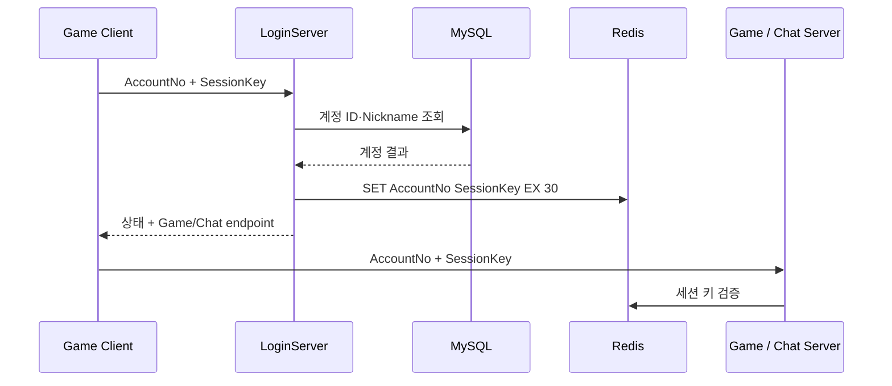

# LoginServer

> 계정 조회와 단기 세션 키 발급을 분리해 게임·채팅 서버 진입을 연결하는 Windows IOCP 로그인 서버

`C++20` · `Windows` · `TCP / IOCP` · `MySQL` · `Redis` · `Prepared Statement`

## 프로젝트 한눈에 보기

| 항목 | 내용 |
|---|---|
| 역할 | 클라이언트 계정 확인과 downstream 서버 접속 정보 전달 |
| 입력 | `AccountNo`와 64-byte `SessionKey` |
| 영속 데이터 | MySQL 계정 정보 조회 |
| 세션 전달 | Redis에 `AccountNo → SessionKey`를 30초 TTL로 저장 |
| 연동 | ChattingServer가 Redis의 키를 다시 검증 |
| 운영 지표 | CPU·메모리·세션·인증 처리량을 MonitoringServer로 전달 |

## 인증 흐름

로그인 서버는 계정 데이터 자체를 다른 서버에 복제하지 않고, 짧게 유지되는 Redis 키로 서버 간 인증 맥락을 전달합니다.

## 핵심 구현

### 1. IOCP 기반 로그인 요청 처리

- 네트워크 완료 이벤트와 세션 send queue를 IOCP worker가 처리합니다.
- 패킷은 고정 필드와 직렬화 버퍼로 읽고, 실패 상태와 Game/Chat endpoint를 응답합니다.
- 로그인 프로토콜은 [`Protocol.h`](LoginServer/Utils/Protocol.h), 처리 흐름은 [`LoginServer.cpp`](LoginServer/Contents/LoginServer.cpp)에 있습니다.

### 2. MySQL 계정 조회

- MySQL C API wrapper가 연결·prepared statement·parameter/result binding을 캡슐화합니다.
- 계정 번호로 ID와 Nickname을 조회한 뒤 로그인 상태를 결정합니다.
- 관련 구현: [`DBConnection.cpp`](LoginServer/Utils/DBConnection.cpp)

### 3. Redis 세션 hand-off

- 인증 요청에 포함된 세션 키를 account number 기준으로 30초간 저장합니다.
- ChattingServer 같은 downstream 서버는 같은 키를 비교해 접속 유효성을 확인합니다.
- 관련 구현: [`Redis.cpp`](LoginServer/Utils/Redis.cpp)

### 4. 두 가지 동시성 실험

| 프로젝트 | 처리 모델 |
|---|---|
| [`LoginServer`](LoginServer) | IOCP worker별 TLS DB·Redis connector 재사용 |
| [`LoginServer_Single`](LoginServer_Single) | 콘텐츠 흐름에서 DB·Redis job을 전용 worker와 lock-free queue로 분리 |

Single 변형의 [`DBJobThread.cpp`](LoginServer_Single/Contents/DBJobThread.cpp)와 [`RedisJobThread.cpp`](LoginServer_Single/Contents/RedisJobThread.cpp)에서 외부 I/O 작업 경계를 비교할 수 있습니다.

## 코드 탐색

| 경로 | 설명 |
|---|---|
| [`LoginServer.sln`](LoginServer.sln) | Visual Studio solution |
| [`LoginServer/Library`](LoginServer/Library) | IOCP, session, ring buffer, packet pool |
| [`LoginServer/Contents`](LoginServer/Contents) | 로그인 패킷과 서버 orchestration |
| [`LoginServer/Utils`](LoginServer/Utils) | MySQL·Redis·로그·모니터링 adapter |
| [`DummyClient_Login`](DummyClient_Login) | 로그인 요청 확인용 클라이언트 자산 |

## 빌드 및 실행 전제

- Visual Studio 2022 toolset `v143`, Windows 10 SDK, C++20
- MySQL client library, `cpp_redis`, `tacopie`, WinSock2
- [`LoginServer.txt`](LoginServer/LoginServer.txt)의 DB·Redis·서버 endpoint 설정을 로컬 환경에 맞게 교체
- MySQL과 Redis를 준비한 뒤 MonitoringServer → LoginServer → client 순서로 확인

> 저장소에 포함된 라이브러리와 프로젝트 설정은 과거 개발 환경 기준입니다. 자격 증명 형태의 설정값은 재사용하지 말고 실행 전에 별도 로컬 값으로 교체해야 합니다.

## 현재 상태

이 저장소는 인증 파이프라인과 외부 I/O 분리 방식을 비교하기 위한 2024년 레거시 포트폴리오입니다. 깨끗한 환경의 재현 빌드·CI·자동 테스트는 아직 없으며, DB binding 수명과 비동기 job 소유권은 후속 현대화에서 우선 검증할 영역입니다.

연계 저장소: [ChattingServer](https://github.com/ldcity/ChattingServer) · [MonitoringServer](https://github.com/ldcity/MonitoringServer)
